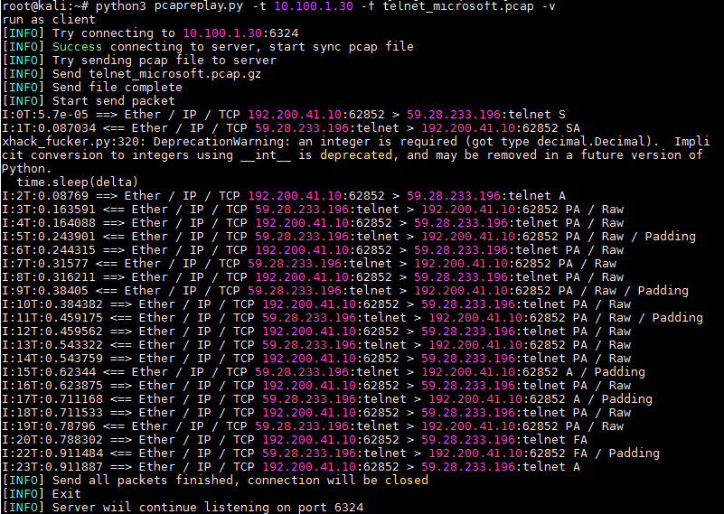
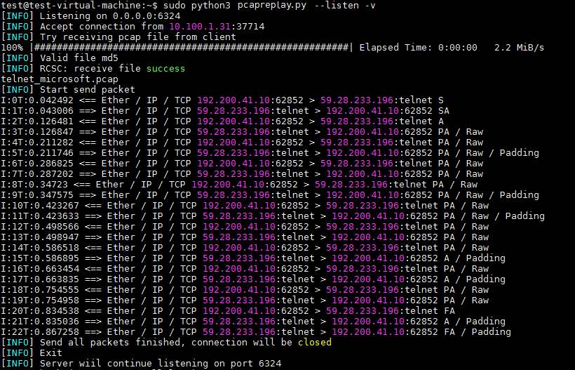

# Pcap Replayer
Pcap Replayer is a tool used for editing and replaying network traffic between client and server for testing your Internet devices. It allows you to replay the traffic back onto the network and through other devices such as switches, routers, firewalls, NIDS and IPS's. It supports based on the packet timestamp so that you can test your devices’ performance on malicious traffic which rely on time-based features, such as slow and distributed brute force attack traffic.

## Secnarios

This tool need deploy on both server-side and client-side, and parse your pcap file and replay back onto the network and through other devices, just like they are really connected and send packets to each other in realtime.

- Perfomance comprasion

A typical scenarios is to test your firewall’s or waf’s detection performance on malicious traffic, you can easily deploy this tool on your intranet client and server where the traffic can through your intermediate device.

-  time features attack testing

  This tool supports  real-time repay, which can be played back according to the original timestamp of the traffic packet. Therefore, it can support some detection based on time features, such as slow brute force and distributed brute force

## How it works

First, deploy two machines on the same network segment, one as a server and one as a client, and make sure that the traffic between the two machines can go through your intermediate device.

- Deploying the server

Execute the following command on the server to enter listening mode to wait for connections from clients

```
python3 pcapreplay.py --listen
```

- Deployment Client

Place the pcap/pcapng file or folder to be replayed in the same directory as the tool, and then select the file, target server, target port. Execute the following command

```
python3 pcapreplay.py -f [file/folder] -t 192.168.1.24 -p 6324
```

- sync file

The client connects to the server, and the pcap file or folder to be replayed is compressed and transmitted to the server, the server receives and decompresses it to verify its md5, then sends the success flag, and  proceeds to the next step after the synchronization between the two ends is completed

- Packet splitting and streaming

The two ends of the pcap file will be pre-processed, according to SYN flag to determine whether it is the beginning of the TCP flow, and  fragment TCP stream according to IP and port, after the server and the client respectively to get the packet list of local end, at last both ends sending a synchronization flag.

- Replay

After receiving the synchronization flag, both ends enter the replay process at the same time, compare the current traffic packet index with the local packet list, if the current traffic packet index is in the local packet list, enter the sending process, send the packet and send a index flag after sleep the gap time of the timestamp. If the current traffic packet index is not in the local packet list, it enters the receive process, and continues to receive socket data to determine the received index.

## Installation

```bash
git clone https://github.com/litheory/PcapReplayer.git
cd PcapReplayer
pip install -r requirements
```

## Extension

- Support adjustment of replay speed by using `-s` `--speed`, which must be an integer multiple.
- Support speedy replay by using `-Q` ` --quick`, which will finish replaying the traffic instantly.
- Support loop replay by using `-L` `--loop`.
- You can use `-i` `--interface` to select the interface to use for send and receive traffic
- Will allow users to pre-edit traffic packets by using `-M` import custom extension.

## ToDo

- Support costum module
- Support loop replay
- Support replay multi pcap at the same time

## Usage

Use python3.8

Deploy on server
```
python3 pcapreplay.py --listen -p 6324
```
Then delploy on client and connect to server, and select which pcap file you want to replay
```
python3 pcapreplay.py -f [pcapfile] -t 192.168.1.24 -p 6324
```
Besides, you can specify the speed rate or use quick mode to send all the packet immediately. 

- How client works

  ```bash
  root@kali:~# python3 pcapreplay.py -t 10.100.1.30 -f telnet_microsoft.pcap -v -p 6325
  run as client
  [INFO] Try connecting to 10.100.1.30:6325
  [INFO] Success connecting to server, start sync pcap file
  [INFO] Try sending pcap file to server
  [INFO] Send telnet_microsoft.pcap.gz
  [INFO] Send file complete
  [INFO] Start send packet
  I:1T:1e-05 ==> Ether / IP / TCP 192.200.41.10:62852 > 59.28.233.196:telnet S
  I:2T:0.090384 <== Ether / IP / TCP 59.28.233.196:telnet > 192.200.41.10:62852 SA
  pcapreplay.py:375: DeprecationWarning: an integer is required (got type decimal.Decimal).  Implicit conversion to integers using __int__ is deprecated, and may be removed in a future version of Python.
    time.sleep(delta)
  I:3T:0.090915 ==> Ether / IP / TCP 192.200.41.10:62852 > 59.28.233.196:telnet A
  I:4T:0.156529 <== Ether / IP / TCP 59.28.233.196:telnet > 192.200.41.10:62852 PA / Raw
  I:5T:0.156947 ==> Ether / IP / TCP 192.200.41.10:62852 > 59.28.233.196:telnet PA / Raw
  I:6T:0.229954 <== Ether / IP / TCP 59.28.233.196:telnet > 192.200.41.10:62852 PA / Raw / Padding
  I:7T:0.230467 ==> Ether / IP / TCP 192.200.41.10:62852 > 59.28.233.196:telnet PA / Raw
  I:8T:0.301207 <== Ether / IP / TCP 59.28.233.196:telnet > 192.200.41.10:62852 PA / Raw
  I:9T:0.301644 ==> Ether / IP / TCP 192.200.41.10:62852 > 59.28.233.196:telnet PA / Raw
  I:10T:0.373422 <== Ether / IP / TCP 59.28.233.196:telnet > 192.200.41.10:62852 PA / Raw / Padding
  I:11T:0.373874 ==> Ether / IP / TCP 192.200.41.10:62852 > 59.28.233.196:telnet PA / Raw
  I:12T:0.452399 <== Ether / IP / TCP 59.28.233.196:telnet > 192.200.41.10:62852 PA / Raw / Padding
  I:13T:0.452845 ==> Ether / IP / TCP 192.200.41.10:62852 > 59.28.233.196:telnet PA / Raw
  I:14T:0.538246 <== Ether / IP / TCP 59.28.233.196:telnet > 192.200.41.10:62852 PA / Raw
  I:15T:0.545968 ==> Ether / IP / TCP 192.200.41.10:62852 > 59.28.233.196:telnet PA / Raw
  I:16T:0.628641 <== Ether / IP / TCP 59.28.233.196:telnet > 192.200.41.10:62852 A / Padding
  I:17T:0.629748 ==> Ether / IP / TCP 192.200.41.10:62852 > 59.28.233.196:telnet PA / Raw
  I:18T:0.715245 <== Ether / IP / TCP 59.28.233.196:telnet > 192.200.41.10:62852 A / Padding
  I:19T:0.715713 ==> Ether / IP / TCP 192.200.41.10:62852 > 59.28.233.196:telnet PA / Raw
  I:20T:0.808539 <== Ether / IP / TCP 59.28.233.196:telnet > 192.200.41.10:62852 PA / Raw
  I:21T:0.808978 ==> Ether / IP / TCP 192.200.41.10:62852 > 59.28.233.196:telnet FA
  I:22T:0.876498 <== Ether / IP / TCP 59.28.233.196:telnet > 192.200.41.10:62852 A / Padding
  I:23T:0.916494 <== Ether / IP / TCP 59.28.233.196:telnet > 192.200.41.10:62852 FA / Padding
  I:24T:0.917867 ==> Ether / IP / TCP 192.200.41.10:62852 > 59.28.233.196:telnet A
  [INFO] Send all packets finished, connection will be closed
  [INFO] Exit
  [INFO] Server wiil continue listening on port 6325
  ```

  

- How server works

  ```bash
  test@test-virtual-machine:~$ sudo python3 pcapreplay.py --listen -v -p 6325
  [INFO] Listening on 0.0.0.0:6325
  [INFO] Accept connection from 10.100.1.31:43564
  [INFO] Try receiving pcap file from client
  100% |###############################################| Elapsed Time: 0:00:00   3.0 MiB/s
  [INFO] Valid file md5
  [INFO] RCSC: receive file success
  telnet_microsoft.pcap
  [INFO] Start send packet
  I:1T:0.11084 <== Ether / IP / TCP 192.200.41.10:62852 > 59.28.233.196:telnet S
  I:2T:0.111229 ==> Ether / IP / TCP 59.28.233.196:telnet > 192.200.41.10:62852 SA
  I:3T:0.173398 <== Ether / IP / TCP 192.200.41.10:62852 > 59.28.233.196:telnet A
  I:4T:0.173719 ==> Ether / IP / TCP 59.28.233.196:telnet > 192.200.41.10:62852 PA / Raw
  I:5T:0.241681 <== Ether / IP / TCP 192.200.41.10:62852 > 59.28.233.196:telnet PA / Raw
  I:6T:0.242028 ==> Ether / IP / TCP 59.28.233.196:telnet > 192.200.41.10:62852 PA / Raw / Padding
  I:7T:0.317422 <== Ether / IP / TCP 192.200.41.10:62852 > 59.28.233.196:telnet PA / Raw
  I:8T:0.31778 ==> Ether / IP / TCP 59.28.233.196:telnet > 192.200.41.10:62852 PA / Raw
  I:9T:0.394335 <== Ether / IP / TCP 192.200.41.10:62852 > 59.28.233.196:telnet PA / Raw
  I:10T:0.394762 ==> Ether / IP / TCP 59.28.233.196:telnet > 192.200.41.10:62852 PA / Raw / Padding
  I:11T:0.461862 <== Ether / IP / TCP 192.200.41.10:62852 > 59.28.233.196:telnet PA / Raw
  I:12T:0.462164 ==> Ether / IP / TCP 59.28.233.196:telnet > 192.200.41.10:62852 PA / Raw / Padding
  I:13T:0.549576 <== Ether / IP / TCP 192.200.41.10:62852 > 59.28.233.196:telnet PA / Raw
  I:14T:0.550032 ==> Ether / IP / TCP 59.28.233.196:telnet > 192.200.41.10:62852 PA / Raw
  I:15T:0.633678 <== Ether / IP / TCP 192.200.41.10:62852 > 59.28.233.196:telnet PA / Raw
  I:16T:0.633985 ==> Ether / IP / TCP 59.28.233.196:telnet > 192.200.41.10:62852 A / Padding
  I:17T:0.725374 <== Ether / IP / TCP 192.200.41.10:62852 > 59.28.233.196:telnet PA / Raw
  I:18T:0.72568 ==> Ether / IP / TCP 59.28.233.196:telnet > 192.200.41.10:62852 A / Padding
  I:19T:0.813497 <== Ether / IP / TCP 192.200.41.10:62852 > 59.28.233.196:telnet PA / Raw
  I:20T:0.813863 ==> Ether / IP / TCP 59.28.233.196:telnet > 192.200.41.10:62852 PA / Raw
  I:21T:0.889676 <== Ether / IP / TCP 192.200.41.10:62852 > 59.28.233.196:telnet FA
  I:22T:0.89002 ==> Ether / IP / TCP 59.28.233.196:telnet > 192.200.41.10:62852 A / Padding
  I:23T:0.929229 ==> Ether / IP / TCP 59.28.233.196:telnet > 192.200.41.10:62852 FA / Padding
  I:24T:1.009487 <== Ether / IP / TCP 192.200.41.10:62852 > 59.28.233.196:telnet A
  [INFO] Send all packets finished, connection will be closed
  [INFO] Exit
  [INFO] Server wiil continue listening on port 6325
  
  ```

  

You can see the help doc by `-h`  or `--help`

```bash
SERVER: pcapreplay.py -i [interface] --listen -t [listen_target] -p [port]
CLIENT: pcapreplay.py -i [interface] -t [target] -p [port] -f [pcapfile]

-i --interface             - CLIENT Client to server traffic output interface
							 SERVER Server to client traffic output interface
							 Default use eth0
-f --file                  - [CLIENT] upon receiving connection upload a file/folder and write to [target]
-l --listen                - [SERVER] listen on [host]:[port] for incoming connections
-t --target                - [CLIENT] connect to target host
							 [SERVER] listening on this host, default on 0.0.0.0
-p --port                  - [CLIENT] connect to target port
							 [SERVER] listen on this port
							 Default use port 6324
-s --speed                 - ajust the speed of replay, -s 4 means replay by 4 times the speed
-Q --quick                 - All packets will be sent finished immediately, must be selected by both ends at 							  the same time
-L --loop 				   - replay in loop
-v --verbose               - Print decoded packets via tcpdump to STDOUT
-d --debug                 - Initiate with debugging mode
-q --quite 				   - Unimportant infomation will be filterd
-h --help                  - Extended usage information passed thru pager

Run as SERVER:
pcapreplay.py -i eth0 --listen -p 6324
Run as CLIENT:
pcapreplay.py -i eth0 -f [pcap_file] -t 192.168.1.24 -p 6324                    
```

# 对端流量回放器

对端流量回放器是一种轻量级、易部署、环境通用的端对端流量回放器。

用于编辑和重放以前由tcpdump和Wireshark等工具捕获的网络流量，能够将流量分类为客户端或服务器，以在网络环境中模拟真实的客户端和服务端交互发包。该工具最后会将流量会放到网络上并通过其他设备，如交换机、路由器、防火墙、NIDS和IPS。

## 应用场景

这个工具需要部署在服务器端和客户端，解析pcap文件并通过其他设备回放到网络上，就像它们真正连接并实时彼此发送数据包一样。

主要用于

- 能力比较

  一个典型的场景是测试防火墙或waf对恶意流量的检测性能，你可以轻松地将此工具部署到您的内部网客户机和服务器上，并使流量可以通过你的中间设备。

- 基于时间特征的检测测试

  该工具支持双端实时回放，可以按照流量包原本时间戳进行回放，因此可以支持一些基于时间特征的检测，如慢速爆破、分布式爆破等

## 工作方式

首先在同一网段下部署两台机器，一台作为服务端一台作为客户端，并确保两台机器交互的流量会经过中间设备。

- 部署服务端

在服务端上执行如下命令，进入监听模式以等待来自客户端的连接，默认在本机6324端口监听全部网络

```
python3 pcapreplay.py --listen
```

- 部署客户端

将要回放的pcap/pcapng文件或文件夹与该工具放在同一目录，然后选择文件、目标服务端、目标端口，默认会连接服务端6324端口。执行如下命令

```
python3 pcapreplay.py -f [file/folder] -t 192.168.1.24 -p 6324
```

- 同步文件

客户端连接上服务器，并将要回放的pcap文件或文件夹压缩后传输给服务端，服务端接收解压验证md5无误后发送接收成功标志，待两端发送接收同步完成进入下一步。

- 分包和分流

然后两端会对pcap文件进行预处理，根据SYN flag判断是否是TCP流起始，然后根据IP和端口对TCP流进行分片，之后服务端和客户端分别获取本端的流量列表，待两端都完成后发送一个同步标志。

- 回放

待收到同步标志后，两端同时进入回放流程，将当前流量包序列和本端流量列表进行对比，若当前流量包序列在本端流量列表中时，进入发送流程，休眠时间戳的空隙时间后发送该包并发送一个序号标志。若当前流量包序列不在本端流量列表中时，进入接收流程，持续接收socket数据判断已接收到的序列。

## 实际效果

- 客户端



- 服务端



## 主要功能

```bash
SERVER: pcapreplay.py -i [interface] --listen -t [listen_target] -p [port]
CLIENT: pcapreplay.py -i [interface] -t [target] -p [port] -f [pcapfile]

-i --interface             - CLIENT Client to server traffic output interface
							 SERVER Server to client traffic output interface
							 Default use eth0
-f --file                  - [CLIENT] upon receiving connection upload a file/folder and write to [target]
-l --listen                - [SERVER] listen on [host]:[port] for incoming connections
-t --target                - [CLIENT] connect to target host
							 [SERVER] listening on this host, default on 0.0.0.0
-p --port                  - [CLIENT] connect to target port
							 [SERVER] listen on this port
							 Default use port 6324
-s --speed                 - ajust the speed of replay, -s 4 means replay by 4 times the speed
-Q --quick                 - All packets will be sent finished immediately, must be selected by both ends at 							  the same time
-L --loop 				   - replay in loop
-v --verbose               - Print decoded packets via tcpdump to STDOUT
-d --debug                 - Initiate with debugging mode
-q --quite 				   - Unimportant infomation will be filterd
-h --help                  - Extended usage information passed thru pager

Run as SERVER:
pcapreplay.py -i eth0 --listen -p 6324
Run as CLIENT:
pcapreplay.py -i eth0 -f [pcap_file] -t 192.168.1.24 -p 6324   
```

## 扩展

- 支持使用`-s` `--speed`调节回放倍速，该值必须为整数倍
- 可以使用`-Q` `–-quick`进行极速回放，该模式会使流量瞬间回放完毕
- 可以使用`-L` `--loop`进行循环回放
- 可以s会用`-i` `--interface`选择回放要使用的网卡，默认使用第一个可用的网卡

考虑到部分中间设备只接收特定网段或IP的流量，因此后续还会集成arp模块来实现任意IP流量的接收，通过这种方式可以支持分布式流量的回放。

这种模块将会以扩展的方式集成，并且将会允许用户使用`-M`导入自定义扩展对流量包进行预编辑。